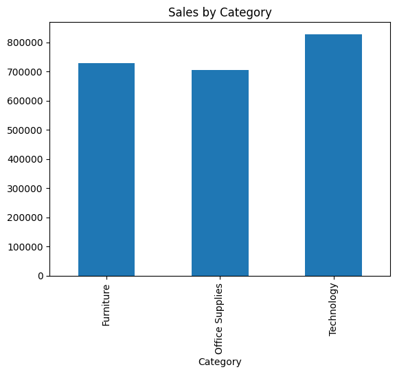
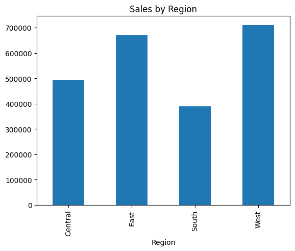

# 📊 Sales Data Analysis Project (E-commerce Dataset)

## 📌 Project Overview

This project analyzes an e-commerce sales dataset to uncover meaningful business insights. Using Python-based data analysis techniques, the project focuses on identifying sales trends, top-performing products, and regional performance to support data-driven decision-making.

---

## 🎯 Objectives

* Analyze sales trends over time
* Identify top-performing products and categories
* Evaluate regional performance
* Understand customer segmentation
* Generate actionable business insights

---

## 🛠️ Tools & Technologies

* Python
* Pandas
* NumPy
* Matplotlib
* Jupyter Notebook / VS Code

---

## 📂 Dataset

* Source: Kaggle (Superstore Sales Dataset)
* Contains:

  * Order details (Order Date, Ship Date, Ship Mode)
  * Customer information (Customer Name, Segment)
  * Product details (Category, Sub-category, Product Name)
  * Sales data (Revenue)

---

## 🧹 Data Cleaning & Preparation

* Handled missing values (Postal Code)
* Converted date columns to proper datetime format
* Removed duplicate records
* Created new features:

  * Year
  * Month
  * Month Name

---

## 📊 Exploratory Data Analysis (EDA)

### 📈 Sales Trend Analysis

* Sales declined slightly in 2016, followed by strong growth in 2017 and 2018
* Indicates recovery and expansion phase of the business

---

### 🛍️ Category Performance

* Technology category generated the highest revenue
* Furniture and Office Supplies contributed significantly but less than Technology

---

### 🌍 Regional Analysis

* West region recorded the highest sales
* South region showed the lowest performance, indicating potential growth opportunities

---

### 👥 Customer Segment Insights

* Consumer segment contributed the largest share of overall sales

---

## 📊 Visualizations

### 📈 Sales Trend

)
Sales increased significantly after 2016, showing strong business growth.

---

### 🛍️ Sales by Category


Technology leads in revenue, indicating high demand for tech products.

---

### 🌍 Sales by Region


West region dominates sales, while South shows potential for improvement.

---

## 💡 Key Insights

* Business experienced strong growth after 2016
* Technology is the primary revenue-driving category
* Regional imbalance suggests scope for targeted strategies
* Sales concentration indicates a few categories drive most revenue

---

## 📁 Project Structure

```
sales-dashboard-project/
│
├── data/
│   └── raw_data.csv
│
├── notebooks/
│   └── analysis.ipynb
│
├── images/
│   ├── sales_trend.png
│   ├── category_sales.png
│   └── region_sales.png
│
└── README.md
```

---

## 🚀 How to Run the Project

1. Clone the repository
2. Install dependencies:

   ```
   pip install pandas numpy matplotlib
   ```
3. Open the notebook:

   ```
   notebooks/analysis.ipynb
   ```
4. Run all cells to reproduce the analysis

---

## 🔮 Future Improvements

* Build an interactive dashboard using Power BI
* Perform sales forecasting using time series models
* Implement customer segmentation (RFM analysis)
* Enhance dataset with profit analysis

---

## 📌 Conclusion

This project demonstrates how raw e-commerce data can be transformed into actionable insights using Python. It highlights the importance of data analysis in understanding business performance and identifying growth opportunities.

---

## 👤 Author

**Sakshi Pandey**
